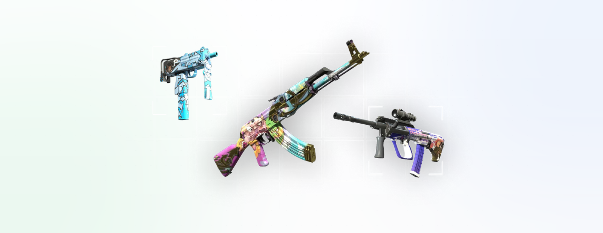

<div align="center">
  

  [Website](https://csl.fun) · [Terminal](https://www.csl.fun/trade) · [Docs](https://docs.csl.fun) · [X](https://x.com/csldotfun)

  
  
  
  
  
  

  
</div>

---

## What is CSL

For over a decade CS:2 skins traded like digital gold — $1B+ yearly volume, stable collector demand — with zero trading infrastructure. CSL is the missing market layer: synthetic perpetual futures on the most iconic skins in Counter-Strike.

→ Long or short 17 curated markets — Dragon Lore, Howl, Karambit Fade and more  
→ Up to 20x leverage with isolated margin and transparent liquidation prices  
→ Real pricing — live marketplace feeds plus full Steam Market history since 2013  
→ Collateral and PnL in USDC on Solana — no inventory, no trade locks, no middlemen

## Architecture

**Price Engine** — aggregates live lowest-listing prices from Skinport and reconstructs every skin's complete daily price history from Steam Market, back to original release. Outlier rejection, per-market candle aggregation, realtime fan-out over Server-Sent Events.

**Trading Engine** — server-authoritative order handling on Postgres: transactional open/close, hourly funding accrual, isolated margin, deterministic liquidation prices fixed at entry.

**Risk Engine** — hard caps enforced at the engine level: per-position collateral limits, per-user position limits, per-market open-interest ceilings, 20x max leverage. A continuous liquidation sweep monitors every open position against live marks.

**Identity Layer** — Privy-verified accounts (X, Google, Phantom). Every order is authenticated server-side; no order can be spoofed from the client.

**Liquidity Vault** — the protocol-owned counterparty: USDC depositors take the other side of trader flow and earn taker fees, with losses and gains shared pro-rata. Opens to public deposits at launch.

**Settlement Layer** — USDC deposits, withdrawals and treasury management on Solana, rolling out with the public launch alongside $CSL.

## Markets

Seventeen of the most liquid, most iconic skins in Counter-Strike — each a standalone perpetual market, priced off real marketplace data.

| Skin | Rarity | Since | Ref. price |
|------|--------|-------|-----------|
|  **AWP \| Dragon Lore** | Covert | 2014 | ~$12,254 |
| **★ Karambit \| Fade** | Knife | 2013 | ~$2,645 |
| **AK-47 \| Fire Serpent** | Covert | 2013 | ~$920 |
| **M4A4 \| Howl** | Contraband | 2014 | ~$5,565 |
| **AWP \| Asiimov** | Covert | 2014 | ~$92 |
| … and 12 more | | | [see all →](https://docs.csl.fun) |

## How a trade works

```
1. Pick a market          AWP | Dragon Lore  ·  $12,254
2. Choose a side          LONG  (profit if price rises)
3. Set leverage           20x
4. Post collateral        $250 USDC
                          ─────────────────────────────
   Position size          $5,000   ·   Liq. price ~$11,637
```

**Worked example — a winning long**

> You post **$250 USDC** collateral on AWP \| Dragon Lore at **20x** → $5,000 notional.
> The reference price moves **+8%**, from $12,254 to $13,234.
> Your PnL = 8% × $5,000 = **+$400** on $250 posted — a **+160%** return on collateral, settled in USDC.
> Had it dropped ~5% instead, the position would liquidate at ~$11,637.

## Leverage & liquidation

Liquidation price is fixed the moment you open, derived from entry, side and leverage — no hidden moves.

| Leverage | Move to liquidation | Example (long @ $12,254) |
|---------:|:-------------------:|:------------------------:|
| 2x | ~50% | ~$6,251 |
| 5x | ~20% | ~$9,865 |
| 10x | ~10% | ~$11,058 |
| 20x | ~5% | ~$11,637 |

*Maintenance margin 0.5% · taker fee 0.06% of notional. Isolated margin — a liquidation never touches your other positions or wallet.*

## Why CSL

| | Buying the skin | Trading on CSL |
|---|:---:|:---:|
| Go short | ❌ | ✅ |
| Leverage | ❌ | ✅ up to 20x |
| Settlement | Item in inventory | USDC on Solana |
| Trade locks / holds | 7 days | None |
| Liquidity | Marketplace-dependent | Instant, protocol-backed |
| Fees | 10–15% marketplace cut | 0.06% taker |

## Roadmap

- ✅ Price engine — live feeds + full Steam Market history
- ✅ Trading engine — isolated margin, funding, liquidations
- ✅ Terminal — charts, order flow, portfolio, leaderboard
- 🔜 Public launch — USDC deposits, liquidity vault, $CSL
- 🔜 More markets, cross-margin, mobile

## FAQ

**Do I own the skin?** No. CSL is synthetic — you trade the *price*, settled in USDC. No inventory, no trade holds.

**Where do prices come from?** Live lowest-listing data from marketplaces, with full daily history reconstructed from Steam Market going back to each skin's release.

**What backs my PnL?** The Liquidity Vault — USDC depositors take the other side of trader flow. It opens to the public at launch.

**Is there a token?** $CSL launches with the public release. Any contract address before then is fake.

## Repositories

| Repo | What it is |
|------|------------|
| [`csl-terminal`](https://github.com/CSLdotFun/csl-terminal) | Trading terminal & landing — Next.js, TradingView charts, Privy auth |
| [`csl-backend`](https://github.com/CSLdotFun/csl-backend) | Price + trading engine — live feeds, candles, funding, risk, liquidations |
| [`csl-docs`](https://github.com/CSLdotFun/csl-docs) | Protocol documentation at [docs.csl.fun](https://docs.csl.fun) |

## Stack

      

---

<div align="center">
  <sub>$CSL launches with the public release — the contract address will be announced only on <a href="https://x.com/csldotfun">@csldotfun</a>. Trust no other source.</sub>
</div>
